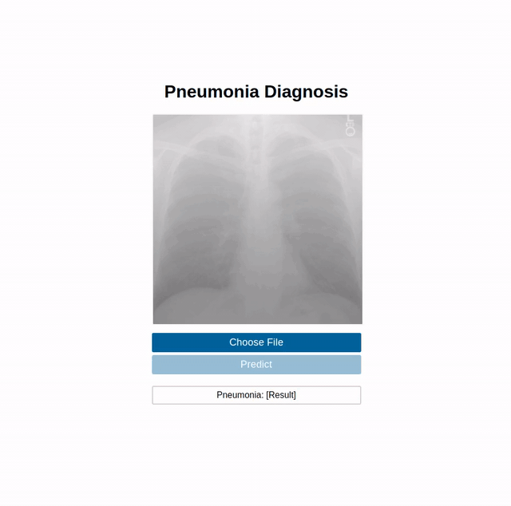

# Pneumonia Diagnosis App

Pneumonia Diagnosis App can detect pneumonia from a chest x-ray image with 88% accuracy. 

## Preview


If you want to check the training algorithm:

[](https://colab.research.google.com/github/Stavrospanakakis/pneumonia-diagnosis/blob/master/pneumonia_diagnosis.ipynb)

[](https://github.com/Stavrospanakakis/pneumonia-diagnosis)
## Development

### Docker

```
# Clone the repository
$ git clone https://github.com/Stavrospanakakis/pneumonia-diagnosis-app.git

# Go to the build folder
$ cd pneumonia-diagnosis-app/build/docker

# Run docker
$ docker-compose up --build
```
Open the browser at http://localhost:3000.

### Manually

#### Install
- Python
- Pip
- Nodejs
- Npm
- Yarn

```
# Clone the repository
$ git clone https://github.com/Stavrospanakakis/pneumonia-diagnosis-app.git

# Set the environment variables
$ echo "export REACT_APP_INTERNAL_IP=localhost" >> ~/.your-bash-profile
$ echo "export REACT_APP_INTERNAL_PORT=:8000" >> ~/.your-bash-profile
```
#### Frontend
```
# Go to the web folder
$ cd pneumonia-diagnosis-app/web

# Install dependancies
$ yarn global add react-scripts
$ yarn 

# Run server
$ yarn start
```

Open the browser at http://localhost:3000.

### Backend
```
# Go to the root folder
$ cd pneumonia-diagnosis-app

# Install dependancies
$ pip install --no-cache-dir -r build/requirements.txt

# Go to the app folder
$ cd app

# Run server
$ python wsgi.py 
```
## Production

Set your custom REACT_APP_INTERNAL_IP and REACT_APP_INTERNAL_PORT.


```
# Install docker and get the docker-compose files
$ wget https://raw.githubusercontent.com/Stavrospanakakis/pneumonia-diagnosis-app/master/scripts/install.sh
$ chmod +x ./install.sh
$ ./install.sh

# Initialize docker swarm
$ docker swarm init 

# Deploy with compose files
$ docker stack deploy -c docker-compose.yml -c docker-compose.prod.yml
```

[](https://github.com/Stavrospanakakis/pneumonia-diagnosis-app/blob/master/LICENSE)
